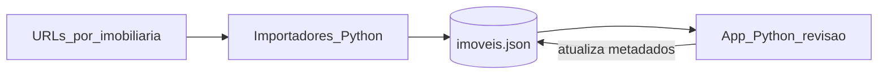

# Mobihunter — visão do produto e roteiro em fases

**Estado atual:** os importadores gravam em **SQLite** (`data/imoveis.db`); a antiga UI (Streamlit/NiceGUI) foi removida. A **próxima stack de revisão** (web ou outra) está por definir.

Este documento descreve o objetivo do projeto, o modelo de dados, a organização de pastas, o contrato dos importadores por imobiliária e o que se espera de uma futura aplicação de revisão. Serve como referência antes e durante a implementação por fases.

## 1. Objetivo

O Mobihunter é um buscador pessoal de imóveis online: você configura **links de páginas já filtradas** (por imobiliária), importa os anúncios para um **único arquivo JSON** e usa uma **interface simples** para navegar, filtrar, categorizar, classificar e comentar os registros — incluindo visualização das fotos.

## 2. Fluxo geral

1. **Entrada:** URLs de listagens ou detalhes, por imobiliária, definidas manualmente ou em lista de configuração.
2. **Importação:** scripts Python **separados por imobiliária** (ex.: Foxter primeiro) que fazem requisição HTTP, extraem dados do HTML ou de APIs internas do site e gravam registros normalizados no JSON central.
3. **Revisão:** uma aplicação (stack a definir) lê os dados (JSON ou SQLite, conforme a implementação), exibe tabela com filtros e imagens, e persiste alterações de **revisão manual**.

## 3. Modelo de dados: um ficheiro, um schema

Todos os importadores escrevem no **mesmo** ficheiro (por exemplo `data/imoveis.json`). O conteúdo é um **array** de objetos `PropertyRecord`.

### 3.1 Campos sugeridos

| Área | Campos |
|------|--------|
| **Identidade** | `id` — UUID ou hash estável derivado de `source_url`; `source_url` — URL canónica do anúncio; `agency` — identificador curto (ex.: `"foxter"`); `imported_at` — data/hora ISO 8601 da última importação bem-sucedida. |
| **Anúncio** | `price` — número; opcional `currency` (ex.: `"BRL"`); `title`; `description` (opcional). |
| **Mídia** | `photos` — array de URLs das imagens; opcional `thumbnail_url`. |
| **Local** | `address`, `city`, `neighborhood`, `state` — preencher o que existir na origem. |
| **Características** | `features` — objeto flexível (ex.: quartos, vagas, área em m², tipo de imóvel) para acomodar diferenças entre sites sem quebrar o schema. |
| **Revisão manual** | `tags` — array de strings; `category` — string ou `null`; `rating` — opcional; `notes` ou `comments` — texto livre, ou array de `{ "text", "created_at" }` se quiser histórico simples. |
| **Técnico (opcional)** | `raw` ou `source_snapshot` — apenas se for necessário depuração; desligado por padrão. |

### 3.2 Responsabilidade por campos

- **Importadores:** preenchem sobretudo dados **do anúncio** (preço, fotos, endereço, características, metadados de origem).
- **App de revisão:** atualiza campos de **classificação humana** (tags, categoria, comentários, notas). A política recomendada é **não apagar** revisão humana em reimportações: ao atualizar pelo mesmo `source_url`, atualizar dados do anúncio e `imported_at`, preservando `tags`, `category`, `notes`/`comments` salvo regra explícita futura.

### 3.3 Deduplicação

- Dois registros com o mesmo `source_url` não devem coexistir: o importador faz **merge** com o existente.
- Reimportação do mesmo anúncio = atualização de campos de anúncio + `imported_at`, mantendo revisão manual quando aplicável.

## 4. Estrutura de pastas proposta

| Caminho | Função |
|---------|--------|
| `data/imoveis.json` | Arquivo canónico dos imóveis. Versionar com cuidado (dados sensíveis ou volume grande podem justificar `.gitignore` + ficheiro de exemplo numa fase posterior). |
| `scripts/importers/` | Um script ou módulo por imobiliária; `common.py` para carregar/gravar JSON, normalização, deduplicação e merge. |
| `app_review/` | Lógica partilhada (filtros, paginação, persistência de revisão); UI removida até nova stack. |

## 5. Importadores (Foxter primeiro)

Cada imobiliária tem **o seu** script (ex.: `scripts/importers/foxter.py`). Novas imobiliárias adicionam novos ficheiros, reutilizando `common.py`.

**Contrato conceptual:**

1. Ler a lista de URLs a partir de configuração (ficheiro YAML/JSON, CLI ou variável de ambiente — a definir na implementação).
2. Para cada URL: obter conteúdo (HTTP), extrair dados (HTML/API conforme o site).
3. Mapear para `PropertyRecord` e fundir em `data/imoveis.json`.
4. Não duplicar por `source_url`; preservar campos de revisão humana no merge.

A técnica exata (scraping estático vs. inspeção de rede) fica para a fase de implementação do importador Foxter.

## 6. Front-end de revisão (a definir)

A escolha anterior (Streamlit / NiceGUI) foi descontinuada no repositório. Para a próxima iteração, candidatos típicos incluem:

- **SPA + API** (React/Vue/Svelte + FastAPI) — máximo controlo de UX.
- **HTMX + servidor** — menos JavaScript, páginas rápidas de iterar.
- **Framework Python full-stack** (Reflex, Solara, etc.) — um só runtime, trade-offs de UX.

Requisitos funcionais abaixo mantêm-se; a tecnologia é deliberadamente aberta.

## 7. Requisitos funcionais do app de revisão

- Listar imóveis em formato tabular.
- Filtrar por imobiliária, preço, texto livre em endereço/bairro, tags.
- Ver fotos (miniaturas e, se possível, vista ampliada ao selecionar um imóvel).
- Editar tags, categoria e comentários; **gravar** alterações no mesmo `imoveis.json`.
- Opcional numa fase posterior: cópia de segurança automática antes de cada gravação.

## 8. Roteiro de implementação em fases

| Fase | Conteúdo |
|------|----------|
| **Fase 0** | Documentação; `requirements.txt` esqueleto; pastas vazias ou `.gitkeep` onde fizer sentido. |
| **Fase 1** | Schema acordado; `data/imoveis.json` inicial `[]`; `common.py` com ler/gravar, merge e deduplicação. |
| **Fase 2** | Importador Foxter + configuração de URLs. |
| **Fase 3** | App de revisão (stack nova): visualização, filtros, edição e persistência (JSON/SQLite conforme modelo vigente). |
| **Fase 4** | Segunda imobiliária (novo script); ajustes no normalizador se necessário. |

---

*Última atualização: documento inicial de alinhamento do repositório Mobihunter.*
